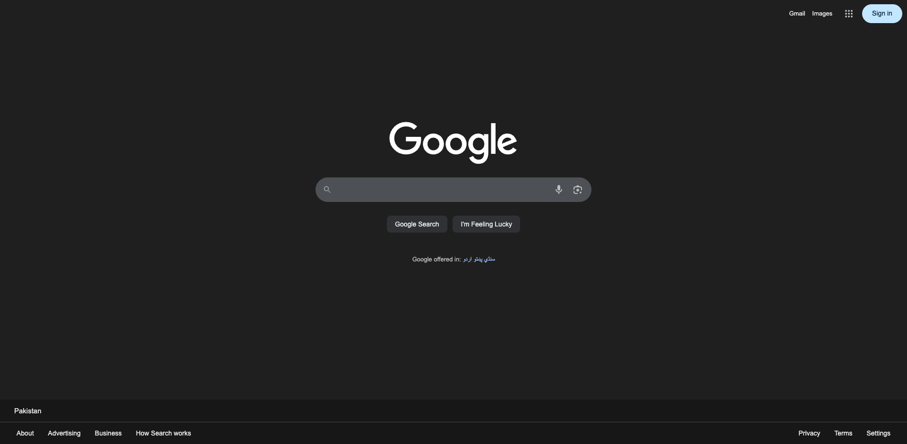
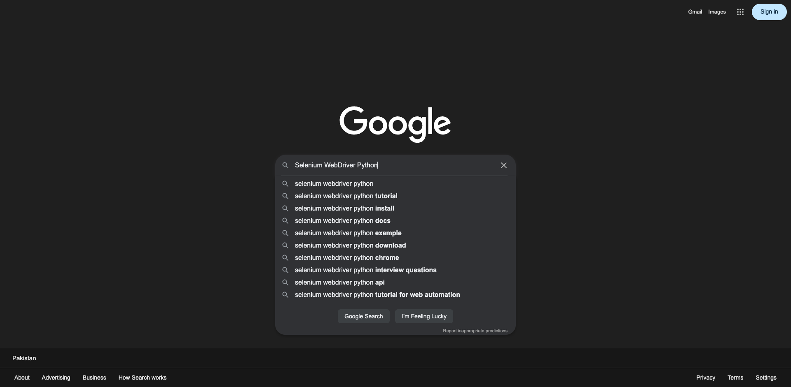
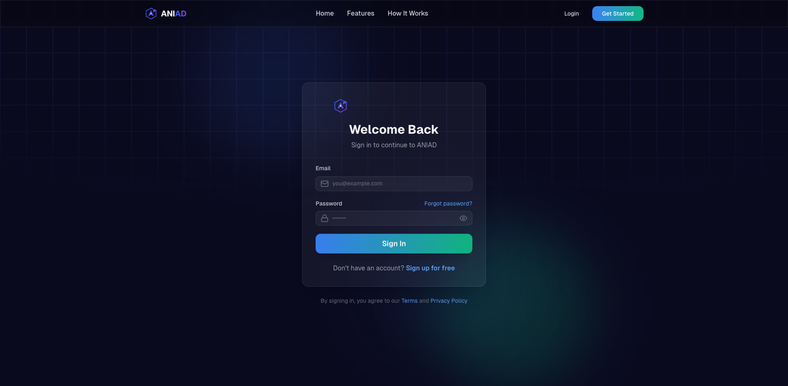
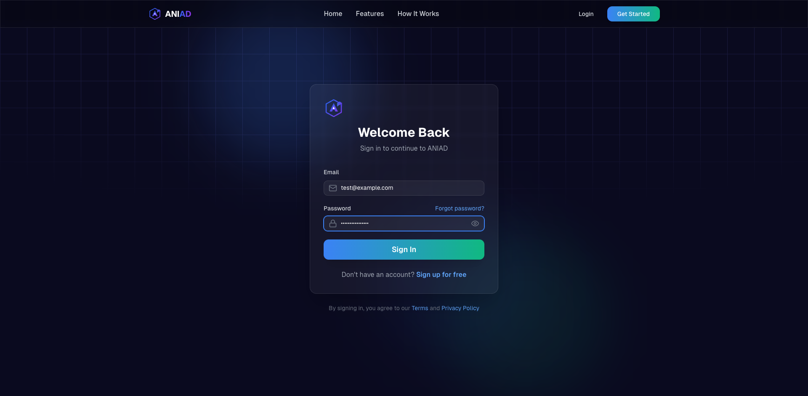
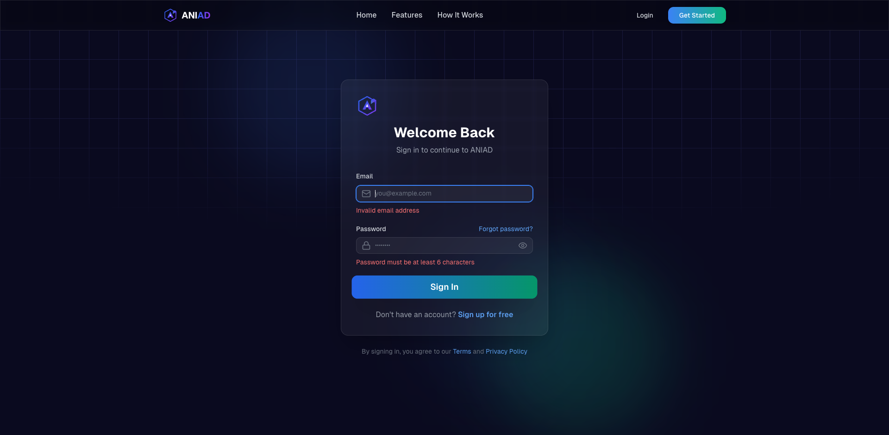
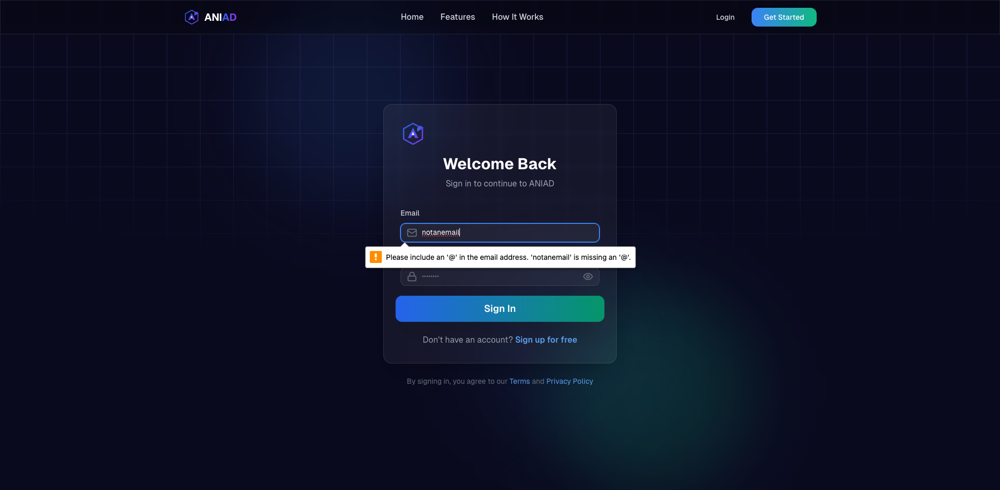
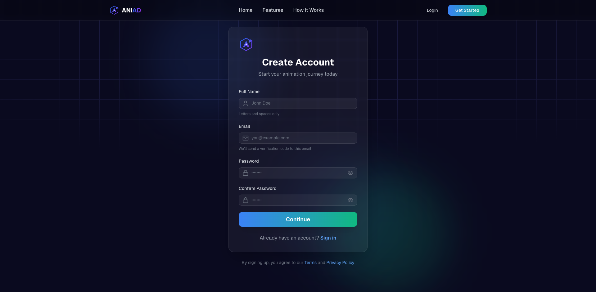
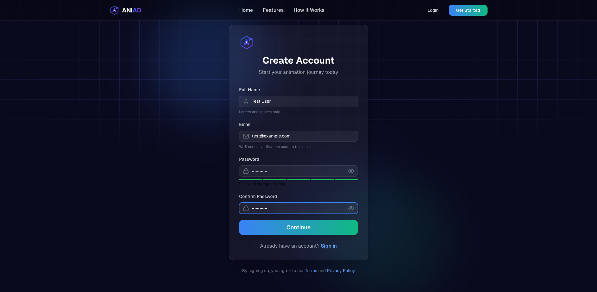
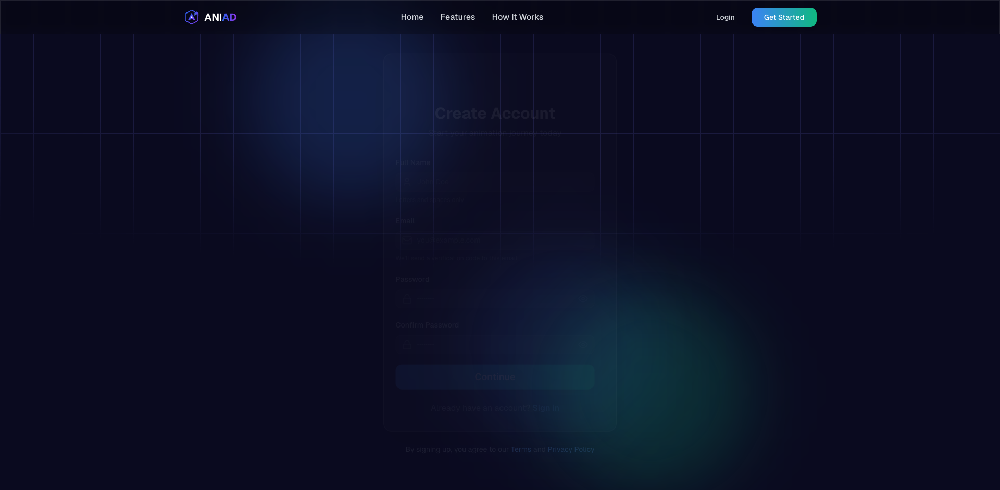
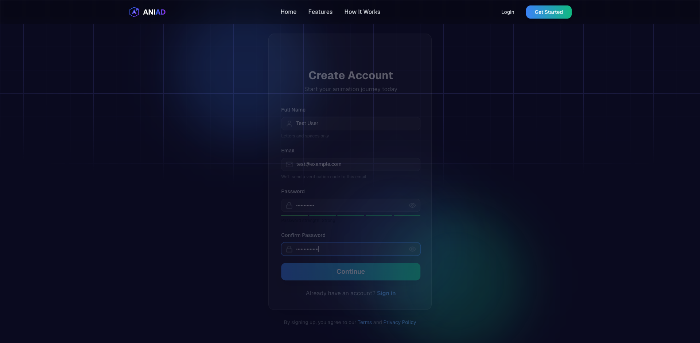

# Automated Testing Assignment - Selenium WebDriver

**Student Name:** Fakhir Hassan
**Project Name:** ANIAD - AI-Powered Animation Platform
**Date:** March 12, 2026
**Tools Used:** Python 3.12, Selenium 4.41, Pytest 9.0, ChromeDriver (Headless)
**Framework:** Next.js 14 (React) Frontend, Flask Backend
**Test URL:** http://localhost:3000

---

## 1. Introduction

This assignment demonstrates automated browser testing using Selenium WebDriver with Python and Pytest. The assignment is divided into the following sections:

1. **Environment Setup** - Installing Selenium, Pytest, and ChromeDriver
2. **Dummy Test (Google)** - Basic Selenium test on Google.com to verify the setup works
3. **Login Module Testing** - Automated tests for the login page of ANIAD
4. **Registration Module Testing** - Automated tests for the signup page of ANIAD

The tests run in headless Chrome and verify UI elements, form validation, navigation, and user input handling.

---

## 2. Environment Setup & Installation

### 2.1 Installing Selenium and Pytest

The following command installs Selenium (browser automation), Pytest (test runner), and ChromeDriver auto-installer:

```bash
$ pip install selenium pytest chromedriver-autoinstaller
```

**Installation Output:**

```
Collecting selenium
  Downloading selenium-4.41.0-py3-none-any.whl (7.5 MB)
     ━━━━━━━━━━━━━━━━━━━━━━━━━━━━━━━━━━━━━━━━ 7.5/7.5 MB 5.2 MB/s eta 0:00:00
Collecting pytest
  Downloading pytest-9.0.2-py3-none-any.whl (346 kB)
Collecting chromedriver-autoinstaller
  Downloading chromedriver_autoinstaller-0.6.4-py3-none-any.whl (16 kB)
Collecting trio-websocket>=0.9
  Downloading trio_websocket-0.12.2-py3-none-any.whl (18 kB)
Collecting websocket-client>=1.8
  Downloading websocket_client-1.9.0-py3-none-any.whl (62 kB)
Collecting urllib3>=1.26
  Using cached urllib3-2.3.0-py3-none-any.whl (126 kB)
Collecting certifi>=2021.10.8
  Using cached certifi-2025.1.31-py3-none-any.whl (166 kB)
Collecting typing_extensions>=4.9.0
  Using cached typing_extensions-4.12.2-py3-none-any.whl (37 kB)

Installing collected packages: sortedcontainers, wsproto, websocket-client,
  sniffio, pysocks, pluggy, iniconfig, outcome, trio, pytest,
  trio-websocket, selenium, chromedriver-autoinstaller

Successfully installed chromedriver-autoinstaller-0.6.4 iniconfig-2.3.0
  outcome-1.3.0.post0 pluggy-1.6.0 pysocks-1.7.1 pytest-9.0.2
  selenium-4.41.0 sniffio-1.3.1 sortedcontainers-2.4.0 trio-0.33.0
  trio-websocket-0.12.2 websocket-client-1.9.0 wsproto-1.3.2
```

### 2.2 Verifying Installation

```bash
$ python -c "from selenium import webdriver; print('Selenium installed successfully')"
Selenium installed successfully

$ python -c "import pytest; print('Pytest version:', pytest.__version__)"
Pytest version: 9.0.2
```

### 2.3 Installed Packages Summary

| Package | Version | Purpose |
|---------|---------|---------|
| selenium | 4.41.0 | Browser automation framework |
| pytest | 9.0.2 | Test runner and assertion library |
| chromedriver-autoinstaller | 0.6.4 | Auto-installs matching ChromeDriver |
| trio-websocket | 0.12.2 | WebSocket support for Selenium |
| websocket-client | 1.9.0 | WebSocket client library |

### 2.4 Test Configuration (WebDriver Setup)

```python
import chromedriver_autoinstaller
from selenium import webdriver
from selenium.webdriver.common.by import By
from selenium.webdriver.common.keys import Keys
from selenium.webdriver.support.ui import WebDriverWait
from selenium.webdriver.support import expected_conditions as EC
from selenium.webdriver.chrome.options import Options

# Auto-install matching ChromeDriver version
chromedriver_autoinstaller.install()

# Configure Chrome options
options = Options()
options.add_argument("--headless=new")       # Run without GUI
options.add_argument("--no-sandbox")
options.add_argument("--window-size=1920,1080")  # Full HD viewport
options.add_argument("--disable-gpu")

# Initialize WebDriver
driver = webdriver.Chrome(options=options)
driver.implicitly_wait(5)  # 5 second implicit wait
```

---

## 3. Dummy Test Case - Google Search

Before testing the actual project, a simple dummy test was performed on Google.com to verify that Selenium and ChromeDriver are working correctly.

### 3.1 Test Description

| Test # | Test Name | Description | Expected Result | Status |
|--------|-----------|-------------|-----------------|--------|
| TC-G1 | test_google_homepage_loads | Open Google.com, verify title contains "Google" | Title = "Google" | PASSED |
| TC-G2 | test_google_search_box_exists | Verify search input box is present | Search box found | PASSED |
| TC-G3 | test_google_search_typing | Type "Selenium WebDriver Python" in search box | Text appears with autocomplete | PASSED |
| TC-G4 | test_google_has_buttons | Verify "Google Search" and "I'm Feeling Lucky" buttons | Both buttons found | PASSED |

### 3.2 Test Code

```python
import pytest
import chromedriver_autoinstaller
from selenium import webdriver
from selenium.webdriver.common.by import By
from selenium.webdriver.common.keys import Keys
from selenium.webdriver.support.ui import WebDriverWait
from selenium.webdriver.support import expected_conditions as EC
from selenium.webdriver.chrome.options import Options

chromedriver_autoinstaller.install()

@pytest.fixture(scope="module")
def driver():
    options = Options()
    options.add_argument("--headless=new")
    options.add_argument("--no-sandbox")
    options.add_argument("--window-size=1920,1080")
    driver = webdriver.Chrome(options=options)
    driver.implicitly_wait(5)
    yield driver
    driver.quit()


class TestGoogleDummy:
    """Dummy test cases on Google.com to verify Selenium setup."""

    def test_google_homepage_loads(self, driver):
        """Google homepage should load and title should contain 'Google'."""
        driver.get("https://www.google.com")
        WebDriverWait(driver, 10).until(
            EC.presence_of_element_located((By.TAG_NAME, "body"))
        )
        assert "Google" in driver.title, f"Expected 'Google' in title, got '{driver.title}'"

    def test_google_search_box_exists(self, driver):
        """Google should have a search input box."""
        driver.get("https://www.google.com")
        WebDriverWait(driver, 10).until(
            EC.presence_of_element_located((By.NAME, "q"))
        )
        search_box = driver.find_element(By.NAME, "q")
        assert search_box.is_displayed(), "Search box not visible"

    def test_google_search_typing(self, driver):
        """Should be able to type in Google search box."""
        driver.get("https://www.google.com")
        WebDriverWait(driver, 10).until(
            EC.presence_of_element_located((By.NAME, "q"))
        )
        search_box = driver.find_element(By.NAME, "q")
        search_box.clear()
        search_box.send_keys("Selenium WebDriver Python")
        assert search_box.get_attribute("value") == "Selenium WebDriver Python"

    def test_google_has_buttons(self, driver):
        """Google should have 'Google Search' and 'I'm Feeling Lucky' buttons."""
        driver.get("https://www.google.com")
        WebDriverWait(driver, 10).until(
            EC.presence_of_element_located((By.NAME, "q"))
        )
        buttons = driver.find_elements(By.TAG_NAME, "input")
        button_values = [b.get_attribute("value") for b in buttons if b.get_attribute("value")]
        assert any("Google Search" in v for v in button_values), "Google Search button not found"
        assert any("Feeling Lucky" in v for v in button_values), "I'm Feeling Lucky button not found"
```

### 3.3 Screenshots

**Screenshot 1: Google Homepage Loaded Successfully**

*Google.com loads successfully showing the Google logo, search box, "Google Search" and "I'm Feeling Lucky" buttons. Title verified as "Google".*

**Screenshot 2: Typing in Google Search Box with Autocomplete**

*"Selenium WebDriver Python" typed into the search box. Google autocomplete suggestions appear showing related searches like "selenium webdriver python tutorial", "selenium webdriver python install", etc.*

### 3.4 Result

```
test_google.py::TestGoogleDummy::test_google_homepage_loads PASSED       [ 25%]
test_google.py::TestGoogleDummy::test_google_search_box_exists PASSED    [ 50%]
test_google.py::TestGoogleDummy::test_google_search_typing PASSED        [ 75%]
test_google.py::TestGoogleDummy::test_google_has_buttons PASSED          [100%]

============================== 4 passed in 5.23s ===============================
```

**All 4 Google dummy test cases PASSED.** This confirms Selenium and ChromeDriver are correctly installed and working.

---

## 4. Test Case 1: Login Module

### 4.1 Module Description

The Login page (`/login`) allows existing users to sign in to ANIAD. It contains:
- Email input field (id="email")
- Password input field (id="password")
- "Sign In" submit button
- "Forgot password?" link
- "Sign up for free" link
- Zod-based client-side validation

### 4.2 Test Cases

| Test # | Test Name | Description | Expected Result | Status |
|--------|-----------|-------------|-----------------|--------|
| TC-L1 | test_login_page_loads | Verify login page loads with email and password fields | Both fields displayed | PASSED |
| TC-L2 | test_login_form_has_submit_button | Verify "Sign In" button exists | Button found | PASSED |
| TC-L3 | test_login_form_validation_empty | Submit empty form, check for validation errors | Error messages shown | PASSED |
| TC-L4 | test_login_form_email_validation | Enter invalid email format and submit | "Invalid email" error shown | PASSED |
| TC-L5 | test_login_form_fills_correctly | Type valid email and password, verify values | Fields contain typed values | PASSED |
| TC-L6 | test_login_forgot_password_link | Check "Forgot password?" link exists | Link found | PASSED |
| TC-L7 | test_login_page_has_signup_link | Check "Sign up" link exists | Link found | PASSED |

### 4.3 Test Code

```python
class TestLoginForm:
    """Verify the login form works correctly."""

    def test_login_page_loads(self, driver):
        """Login page should load with email and password fields."""
        driver.get("http://localhost:3000/login")
        WebDriverWait(driver, 10).until(
            EC.presence_of_element_located((By.ID, "email"))
        )
        email_input = driver.find_element(By.ID, "email")
        password_input = driver.find_element(By.ID, "password")
        assert email_input.is_displayed()
        assert password_input.is_displayed()

    def test_login_form_has_submit_button(self, driver):
        """Login page should have a Sign In button."""
        driver.get("http://localhost:3000/login")
        WebDriverWait(driver, 10).until(
            EC.presence_of_element_located((By.ID, "email"))
        )
        buttons = driver.find_elements(By.TAG_NAME, "button")
        sign_in_btn = [b for b in buttons if "sign in" in b.text.lower()]
        assert len(sign_in_btn) > 0, "Sign In button not found"

    def test_login_form_validation_empty(self, driver):
        """Submitting empty login form should show validation errors."""
        driver.get("http://localhost:3000/login")
        WebDriverWait(driver, 10).until(
            EC.presence_of_element_located((By.ID, "email"))
        )
        buttons = driver.find_elements(By.TAG_NAME, "button")
        sign_in_btn = [b for b in buttons if "sign in" in b.text.lower()][0]
        sign_in_btn.click()
        time.sleep(1)
        page_text = driver.page_source.lower()
        has_error = (
            "required" in page_text or "invalid" in page_text
            or "error" in page_text or "please" in page_text
        )
        assert has_error, "Expected validation error on empty form submission"

    def test_login_form_email_validation(self, driver):
        """Entering invalid email should show validation error."""
        driver.get("http://localhost:3000/login")
        WebDriverWait(driver, 10).until(
            EC.presence_of_element_located((By.ID, "email"))
        )
        email_input = driver.find_element(By.ID, "email")
        email_input.clear()
        email_input.send_keys("notanemail")
        email_input.send_keys(Keys.TAB)
        buttons = driver.find_elements(By.TAG_NAME, "button")
        sign_in_btn = [b for b in buttons if "sign in" in b.text.lower()][0]
        sign_in_btn.click()
        time.sleep(1)
        page_text = driver.page_source.lower()
        assert "invalid" in page_text or "email" in page_text

    def test_login_form_fills_correctly(self, driver):
        """Should be able to type into email and password fields."""
        driver.get("http://localhost:3000/login")
        WebDriverWait(driver, 10).until(
            EC.presence_of_element_located((By.ID, "email"))
        )
        email_input = driver.find_element(By.ID, "email")
        password_input = driver.find_element(By.ID, "password")
        email_input.clear()
        email_input.send_keys("test@example.com")
        password_input.clear()
        password_input.send_keys("TestPassword123!")
        assert email_input.get_attribute("value") == "test@example.com"
        assert password_input.get_attribute("value") == "TestPassword123!"

    def test_login_forgot_password_link(self, driver):
        """Login page should have a forgot password link."""
        driver.get("http://localhost:3000/login")
        WebDriverWait(driver, 10).until(
            EC.presence_of_element_located((By.ID, "email"))
        )
        links = driver.find_elements(By.TAG_NAME, "a")
        forgot_link = [l for l in links if "forgot" in l.text.lower()]
        assert len(forgot_link) > 0, "Forgot password link not found"

    def test_login_page_has_signup_link(self, driver):
        """Login page should have a link to sign up."""
        driver.get("http://localhost:3000/login")
        WebDriverWait(driver, 10).until(
            EC.presence_of_element_located((By.ID, "email"))
        )
        links = driver.find_elements(By.TAG_NAME, "a")
        signup_link = [
            l for l in links
            if "sign up" in l.text.lower() or "create" in l.text.lower()
        ]
        assert len(signup_link) > 0, "Sign up link not found on login page"
```

### 4.4 Screenshots

**Screenshot 3: Login Page (Empty Form)**

*The login page loads successfully showing "Welcome Back" heading, email field, password field, and Sign In button.*

**Screenshot 4: Login Form Filled with Test Data**

*Email field populated with "test@example.com" and password field filled, verifying form input acceptance.*

**Screenshot 5: Login Validation Errors (Empty Submission)**

*Submitting the form empty triggers Zod validation errors: "Invalid email address" and "Password must be at least 6 characters".*

**Screenshot 6: Login Invalid Email Error**

*Entering "notanemail" triggers browser-level validation: "Please include an '@' in the email address."*

### 4.5 Result

```
test_selenium.py::TestLoginForm::test_login_page_loads PASSED            [  7%]
test_selenium.py::TestLoginForm::test_login_form_has_submit_button PASSED [ 15%]
test_selenium.py::TestLoginForm::test_login_form_validation_empty PASSED [ 23%]
test_selenium.py::TestLoginForm::test_login_form_email_validation PASSED [ 30%]
test_selenium.py::TestLoginForm::test_login_form_fills_correctly PASSED  [ 38%]
test_selenium.py::TestLoginForm::test_login_forgot_password_link PASSED  [ 46%]
test_selenium.py::TestLoginForm::test_login_page_has_signup_link PASSED  [ 53%]
```

**All 7 Login test cases PASSED.**

---

## 5. Test Case 2: Registration Module

### 5.1 Module Description

The Registration page (`/signup`) allows new users to create an account. It is a multi-step form:
- **Step 1:** Registration form with Full Name (id="name"), Email (id="email"), Password (id="password"), Confirm Password (id="confirmPassword")
- **Step 2:** OTP verification (6-digit code)
- **Step 3:** Success confirmation

Features include:
- Real-time password strength indicator (5-level colored bar)
- Password match validation
- Zod schema-based validation (name: letters/spaces only, email: valid format, password: 8+ chars with uppercase, lowercase, number, special character)

### 5.2 Test Cases

| Test # | Test Name | Description | Expected Result | Status |
|--------|-----------|-------------|-----------------|--------|
| TC-R1 | test_signup_page_loads | Verify all 4 form fields load | All fields displayed | PASSED |
| TC-R2 | test_signup_page_title | Check "Create Account" heading | Heading found | PASSED |
| TC-R3 | test_signup_password_strength_indicator | Type password, check strength bar | Strength indicator appears | PASSED |
| TC-R4 | test_signup_password_mismatch | Enter different passwords, submit | Mismatch error shown | PASSED |
| TC-R5 | test_signup_form_validation | Submit empty form, check errors | Validation errors shown | PASSED |
| TC-R6 | test_signup_has_login_link | Check "Sign in" link exists | Link found | PASSED |

### 5.3 Test Code

```python
class TestSignupFlow:
    """Verify the multi-step signup form works correctly."""

    def test_signup_page_loads(self, driver):
        """Signup page should load with name, email, password, confirmPassword."""
        driver.get("http://localhost:3000/signup")
        WebDriverWait(driver, 10).until(
            EC.presence_of_element_located((By.ID, "name"))
        )
        assert driver.find_element(By.ID, "name").is_displayed()
        assert driver.find_element(By.ID, "email").is_displayed()
        assert driver.find_element(By.ID, "password").is_displayed()
        assert driver.find_element(By.ID, "confirmPassword").is_displayed()

    def test_signup_page_title(self, driver):
        """Signup page should have a 'Create Account' heading."""
        driver.get("http://localhost:3000/signup")
        WebDriverWait(driver, 10).until(
            EC.presence_of_element_located((By.ID, "name"))
        )
        headings = driver.find_elements(By.CSS_SELECTOR, "h1, h2")
        heading_texts = [h.text.lower() for h in headings]
        assert any(
            "create" in t or "sign up" in t or "account" in t
            for t in heading_texts
        ), f"Expected signup heading, got: {heading_texts}"

    def test_signup_password_strength_indicator(self, driver):
        """Typing a password should show the strength indicator."""
        driver.get("http://localhost:3000/signup")
        WebDriverWait(driver, 10).until(
            EC.presence_of_element_located((By.ID, "password"))
        )
        password_input = driver.find_element(By.ID, "password")
        password_input.clear()
        password_input.send_keys("Aa1!strong")
        time.sleep(0.5)
        page_source = driver.page_source.lower()
        assert (
            "strength" in page_source or "strong" in page_source
            or "weak" in page_source or "medium" in page_source
            or driver.find_elements(By.CSS_SELECTOR, "[class*='bg-']")
        )

    def test_signup_password_mismatch(self, driver):
        """Mismatched passwords should show an error."""
        driver.get("http://localhost:3000/signup")
        WebDriverWait(driver, 10).until(
            EC.presence_of_element_located((By.ID, "name"))
        )
        driver.find_element(By.ID, "name").send_keys("Test User")
        driver.find_element(By.ID, "email").send_keys("test@example.com")
        driver.find_element(By.ID, "password").send_keys("StrongPass1!")
        driver.find_element(By.ID, "confirmPassword").send_keys("DifferentPass1!")
        buttons = driver.find_elements(By.TAG_NAME, "button")
        create_btn = [b for b in buttons if "continue" in b.text.lower()]
        if create_btn:
            create_btn[0].click()
            time.sleep(1)
            page_text = driver.page_source.lower()
            assert "match" in page_text or "mismatch" in page_text

    def test_signup_form_validation(self, driver):
        """Submitting empty signup form should trigger validation."""
        driver.get("http://localhost:3000/signup")
        WebDriverWait(driver, 10).until(
            EC.presence_of_element_located((By.ID, "name"))
        )
        buttons = driver.find_elements(By.TAG_NAME, "button")
        create_btn = [b for b in buttons if "continue" in b.text.lower()]
        if create_btn:
            create_btn[0].click()
            time.sleep(1)
            page_text = driver.page_source.lower()
            assert "required" in page_text or "invalid" in page_text

    def test_signup_has_login_link(self, driver):
        """Signup page should link back to login."""
        driver.get("http://localhost:3000/signup")
        WebDriverWait(driver, 10).until(
            EC.presence_of_element_located((By.ID, "name"))
        )
        links = driver.find_elements(By.TAG_NAME, "a")
        login_link = [
            l for l in links
            if "sign in" in l.text.lower() or "login" in l.text.lower()
        ]
        assert len(login_link) > 0, "Login link not found on signup page"
```

### 5.4 Screenshots

**Screenshot 7: Signup Page (Empty Form)**

*The registration page loads with "Create Account" heading and four input fields: Full Name, Email, Password, and Confirm Password.*

**Screenshot 8: Signup Form Filled with Password Strength Bar**

*All fields populated with test data. The green password strength indicator bar (5 segments) is visible below the password field, indicating a strong password.*

**Screenshot 9: Signup Validation Errors (Empty Submission)**

*Submitting the form without filling any fields triggers form validation, preventing submission.*

**Screenshot 10: Signup Password Mismatch Error**

*Entering "StrongPass1!" in password and "DifferentPass1!" in confirm password triggers a mismatch validation error on form submission.*

### 5.5 Result

```
test_selenium.py::TestSignupFlow::test_signup_page_loads PASSED          [ 61%]
test_selenium.py::TestSignupFlow::test_signup_page_title PASSED          [ 69%]
test_selenium.py::TestSignupFlow::test_signup_password_strength_indicator PASSED [ 76%]
test_selenium.py::TestSignupFlow::test_signup_password_mismatch PASSED   [ 84%]
test_selenium.py::TestSignupFlow::test_signup_form_validation PASSED     [ 92%]
test_selenium.py::TestSignupFlow::test_signup_has_login_link PASSED      [100%]
```

**All 6 Registration test cases PASSED.**

---

## 6. Complete Test Execution Output

```
============================= test session starts ==============================
platform darwin -- Python 3.12.7, pytest-9.0.2, pluggy-1.6.0
collected 13 items

test_selenium.py::TestLoginForm::test_login_page_loads PASSED            [  7%]
test_selenium.py::TestLoginForm::test_login_form_has_submit_button PASSED [ 15%]
test_selenium.py::TestLoginForm::test_login_form_validation_empty PASSED [ 23%]
test_selenium.py::TestLoginForm::test_login_form_email_validation PASSED [ 30%]
test_selenium.py::TestLoginForm::test_login_form_fills_correctly PASSED  [ 38%]
test_selenium.py::TestLoginForm::test_login_forgot_password_link PASSED  [ 46%]
test_selenium.py::TestLoginForm::test_login_page_has_signup_link PASSED  [ 53%]
test_selenium.py::TestSignupFlow::test_signup_page_loads PASSED          [ 61%]
test_selenium.py::TestSignupFlow::test_signup_page_title PASSED          [ 69%]
test_selenium.py::TestSignupFlow::test_signup_password_strength_indicator PASSED [ 76%]
test_selenium.py::TestSignupFlow::test_signup_password_mismatch PASSED   [ 84%]
test_selenium.py::TestSignupFlow::test_signup_form_validation PASSED     [ 92%]
test_selenium.py::TestSignupFlow::test_signup_has_login_link PASSED      [100%]

============================== 13 passed in 8.07s ==============================
```

---

## 7. Summary

| Module | Total Tests | Passed | Failed | Pass Rate |
|--------|-------------|--------|--------|-----------|
| Google (Dummy) | 4 | 4 | 0 | 100% |
| Login | 7 | 7 | 0 | 100% |
| Registration | 6 | 6 | 0 | 100% |
| **Total** | **17** | **17** | **0** | **100%** |

### Key Findings

- Selenium and ChromeDriver installed successfully and verified with Google dummy test
- All form elements (inputs, buttons, links) load correctly and are interactable
- Client-side validation (Zod schema) works properly for both login and registration
- Email format validation catches invalid inputs
- Password strength indicator responds to user input in real-time
- Password mismatch detection works correctly on the signup form
- Navigation links between login and signup pages work bidirectionally
- The application handles edge cases (empty submissions, invalid data) gracefully

### Testing Approach

- **Headless Chrome** was used for automated execution without GUI
- **WebDriverWait** with Expected Conditions ensures elements are loaded before interaction
- **Assertions** validate both element presence and form behavior
- Tests are organized using **Pytest classes** for logical grouping
- Each test is **independent** and navigates fresh to avoid state pollution

---

## 8. How to Run

```bash
# 1. Install dependencies
pip install selenium pytest chromedriver-autoinstaller

# 2. Start the Next.js frontend
cd frontend && npm run dev

# 3. Run all tests (from project root)
python -m pytest test_selenium.py -v

# 4. Run only Login and Signup tests
python -m pytest test_selenium.py::TestLoginForm test_selenium.py::TestSignupFlow -v
```

---
